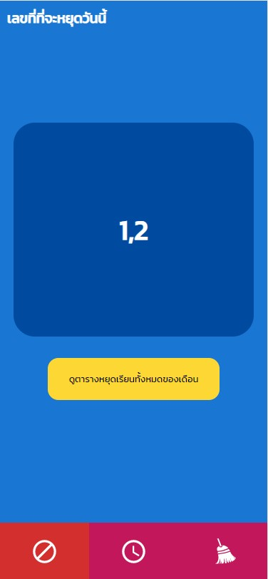
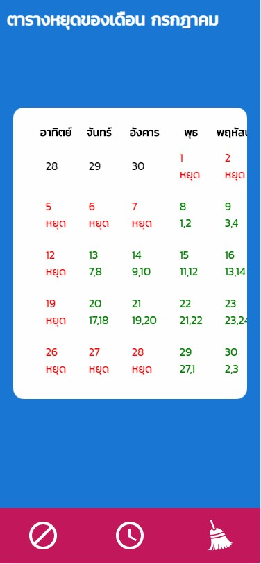
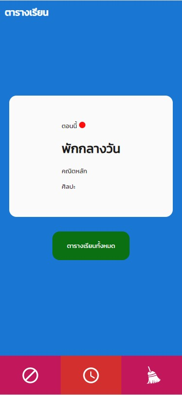
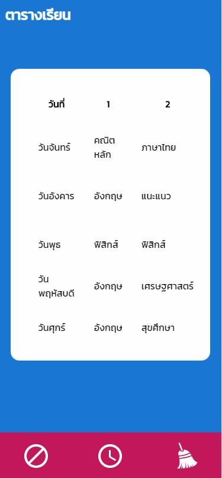
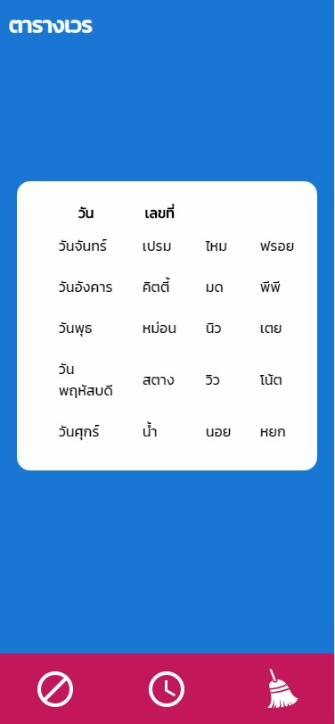
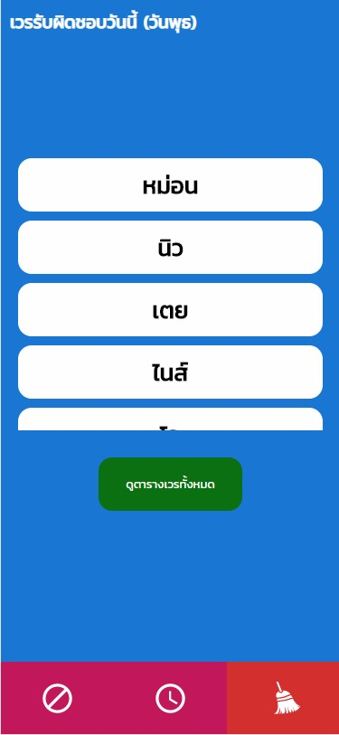

# แอพพลิเคชั่นตารางหยุดเรียน ตารางสอน และตรางเวร (Progressive web app)
หลังจากที่เปิดเทอมกันแล้ว ทางกระทรวงศึกษาธิการได้ให้นักเรียนมาห้องเรียนวันละ 25 คนต่อหนึ่งห้องและจะมีนักเรียนจำนวนหนึ่งหยุดเรียน ซึ่งโปรเจ็คนี้เป็น
แอพที่จะช่วยทำให้นักเรียนเข้าถึงข้อมูลตารางสอน,ตารางเวร หรือแม้แต่ตารางหยุดเรียนได้ง่ายมากขึ้น โดยที่ตารางหยุดเรียนจะมีแค่เดือนเดียว
# Screenshots from this project

## This project using these languages/Libaries/Whatever
* Javascript
* [React](https://reactjs.org/)
* [React Router Dom](https://www.npmjs.com/package/react-router-dom)
* Json
* Html
* CSS

## install 
* เปลี่ยนข้อมูลใน folder JSON

## Creator
[Thistine](https://thistine.com)

## Have Fun
:)
